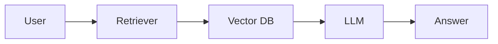
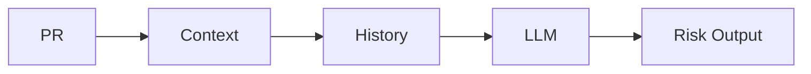

# 🚀 Akshima Sharma

### Generative AI Engineer | RAG · Agents · LLMOps

🌐 https://akshima09.github.io
📫 [akshimasharma.connect@gmail.com](mailto:akshimasharma.connect@gmail.com)
🔗 https://linkedin.com/in/akshimasharma09

---

## 🧠 About Me

I build **production-grade AI systems** using LLMs, RAG, and agent workflows.
Focused on making AI reliable, scalable, and actually useful.

---

## 🚀 Projects

### ⚡ Athena — RAG QA System

* +25% retrieval accuracy
* -15% hallucination
* -40% latency

---

### 🤖 PR Risk Analyzer

* Saves 2–4 hours per PR
* 70–80% manual work reduced

---

### 🧑‍💼 SourceSmart

* 90% matching accuracy
* 45% effort reduction

---

### 📄 OCR System

* AWS Lambda pipelines
* NLP + Presidio masking

---

## 🎥 Demo

(Add later)

---

## 📊 GitHub

---

## 📫 Contact

LinkedIn: https://linkedin.com/in/akshimasharma09
Email: [akshimasharma.connect@gmail.com](mailto:akshimasharma.connect@gmail.com)
