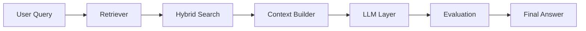

<!-- Minimal clean header -->

<h1 align="center">Akshima Sharma</h1>

  <b>Generative AI Engineer · RAG · Agents · LLMOps</b>

  <a href="https://akshima09.github.io">Portfolio</a> •
  <a href="https://linkedin.com/in/akshimasharma09">LinkedIn</a> •
  <a href="mailto:akshimasharma.connect@gmail.com">Email</a>

---

## 🧠 About

I build **production-grade AI systems** using LLMs, focusing on reliability, scalability, and real-world impact.

My work sits at the intersection of:

* Retrieval-Augmented Generation (RAG)
* Agent-based systems
* LLM evaluation & hallucination reduction
* Backend systems for AI at scale

---

## 🚀 Featured Work

### ⚡ Athena — Enterprise RAG QA System

A production-ready question-answering system over enterprise data.

**Impact**

* Improved retrieval accuracy by **25%**
* Reduced hallucination by **~15%**
* Optimized latency & cost by **25–40%**

**What I built**

* Hybrid retrieval (RRF + semantic search)
* LLM orchestration layer (multi-provider)
* Evaluation pipeline (LLM-as-a-judge)
* OCR + ingestion pipeline with semantic chunking

**Architecture**

**Demo**

---

### 🤖 PR Risk Analyzer (Agentic AI)

An AI system that analyzes pull requests for security and logic risks.

**Impact**

* Saved **2–4 hours per PR review**
* Reduced manual effort by **70–80%**

**What I built**

* Contextual + historical PR understanding
* Elasticsearch-based knowledge retrieval
* Structured outputs (risk, confidence, impact)
* Feedback loop for continuous improvement

---

### 🧑‍💼 SourceSmart — AI Recruitment Platform

An intelligent recruitment system powered by LLMs.

**Impact**

* Achieved **90% candidate matching accuracy**
* Reduced screening time by **60%**
* Improved recruiter efficiency by **45%**

**What I built**

* LLM-based candidate matching
* Embedding-based retrieval
* Scalable backend with Redis Queue + MinIO

---

### 📄 OCR & Anonymization System

Automated system for detecting and masking sensitive data.

**What I built**

* OCR pipelines using AWS Lambda
* NLP + Presidio-based anonymization
* Regex + NER-based masking workflows
* Optimized ingestion and processing pipelines

---

## 🧠 Case Study — Reducing Hallucination in RAG

**Problem**
LLM responses were inconsistent and sometimes hallucinated.

**Approach**

* Introduced hybrid retrieval (RRF + semantic)
* Built evaluation pipeline using LLM-as-a-judge
* Improved grounding through better context selection

**Outcome**

* Reduced hallucination by ~15%
* Improved reliability of responses in production

---

## 🛠️ Tech Stack

**AI / LLMs**
RAG · LangChain · LangGraph · OpenAI · Claude · Prompt Engineering

**Backend**
Python · FastAPI · Django · Flask

**Data & Retrieval**
Elasticsearch · FAISS · Pinecone · PostgreSQL · MongoDB

**Cloud & Infra**
AWS · GCP · Docker · Kubernetes · CI/CD

---

## 🎯 What I Focus On

* Making LLM systems **reliable, not just impressive**
* Building **production-ready AI**, not demos
* Designing systems that scale with real data

---

## 📫 Contact

* LinkedIn: https://linkedin.com/in/akshimasharma09
* Email: [akshimasharma.connect@gmail.com](mailto:akshimasharma.connect@gmail.com)
