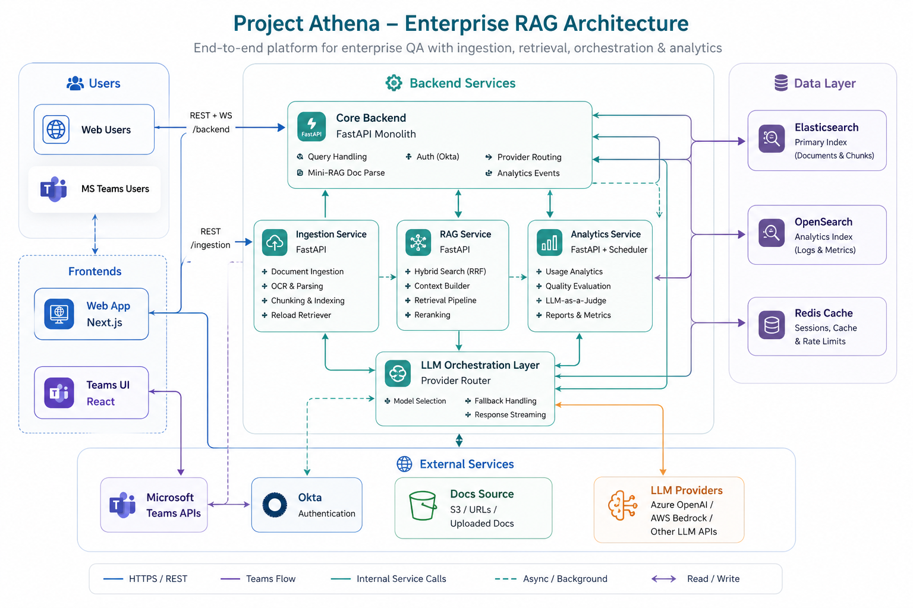
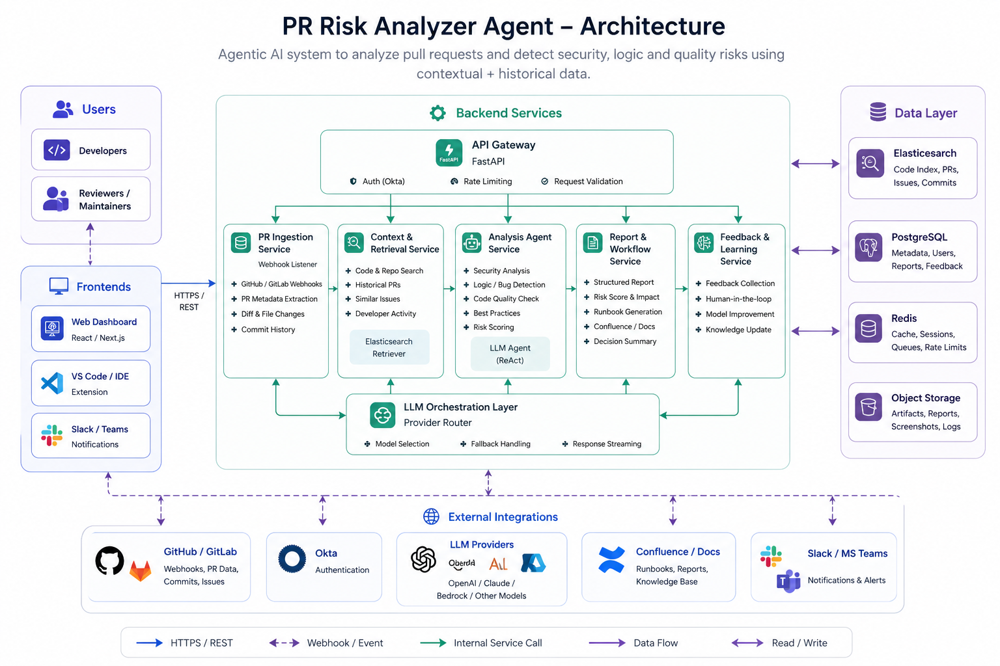

<h1 align="center">Hi, I'm Akshima Sharma 👋</h1>

  <b>Generative AI Engineer · LLMs · RAG · Agents · LLMOps</b> 
  Building production-grade AI systems that are reliable, fast, and actually useful.

  <a href="https://resilient-praline-1e5c44.netlify.app/" target="_blank">🌐 Portfolio</a> &nbsp;·&nbsp;
  <a href="https://www.linkedin.com/in/akshimasharma09/" target="_blank">💼 LinkedIn</a> &nbsp;·&nbsp;
  <a href="mailto:akshimasharma.connect@gmail.com">📧 Email</a>

---

### 👩‍💻 About Me

I'm a Generative AI Engineer with 3 years of experience building and deploying LLM-powered applications in production. I specialise in **RAG pipelines**, **agentic workflows**, and **LLM evaluation** — focused on reducing hallucinations, improving retrieval accuracy, and shipping AI that works reliably at scale.

Currently at **Trantor Pvt Ltd, Chandigarh**, working on enterprise GenAI products.

---

### 🚀 Featured Projects

#### 🔍 Project Athena — Enterprise RAG QA System
> Production RAG system over enterprise documentation using LangChain, hybrid search (RRF), and LLM orchestration.

- 📈 Retrieval accuracy improved by **25%**
- 🧠 Hallucination rates reduced **~15%**
- ⚡ Latency and cost cut **25–40%**
- 🔧 OCR + semantic chunking redesign boosted accuracy by **30%**
- 💬 MS Teams integration with Adaptive Cards

#### 🧠 Architecture

  

  End-to-end enterprise RAG architecture for ingestion, retrieval, orchestration, and analytics.

---

#### 🤖 LLM-Based PR Risk Analyzer Agent
> Agentic system to analyze security and logic risks in pull requests.

- 🗂️ Elasticsearch knowledge base
- 📊 Structured outputs: risk scores & confidence
- 📝 Manual effort reduced **70–80%**
- ⏱️ Saved **2–4 hours** per PR

#### 🧠 Architecture

  

  Agentic PR risk analysis architecture for security, logic, and quality workflows.

---

#### 🧑‍💼 SourceSmart — AI Recruitment Platform
> LLM-powered candidate matching system.

- 🎯 **90% matching accuracy**
- 📉 Recruiter effort ↓ **45%**
- 📦 Scales to **5000+ resumes/project**

#### 🧠 Architecture

  

  AI recruitment pipeline for resume ingestion, semantic matching, and ranking.

---

#### ⚙️ Automation Anywhere — OCR & PII Anonymization
> Automated OCR + anonymization pipeline for sensitive data handling.

- 🔍 OCR extraction from documents
- 🔐 PII detection & masking
- 📄 Redacted output generation pipeline

#### 🧠 Architecture

  

  OCR-to-anonymization pipeline for automated PII detection and masking.

---

### 🛠️ Tech Stack

| Area | Tools |
|------|-------|
| **Generative AI** | RAG, LangChain, LangGraph, OpenAI API, Claude API |
| **LLM Evaluation** | LLM-as-a-judge, Hallucination benchmarking |
| **Vector & Search** | FAISS, Pinecone, Elasticsearch |
| **Backend** | FastAPI, Django, Flask |
| **Databases** | PostgreSQL, MongoDB, Redis |
| **MLOps & DevOps** | Docker, Kubernetes, CI/CD |
| **Cloud** | AWS, GCP |
| **Data** | ETL, OCR, Web Scraping |

---

### 🎓 Education

- 🎓 **M.Sc. Systems Biology & Bioinformatics** — Panjab University
- 🎓 **B.Sc. (Hons.) Bioinformatics** — Panjab University

---

### 📬 Let's Connect

I'm open to **Generative AI**, **LLM Engineering**, and **ML Engineer** roles.  
Reach out via [LinkedIn](https://www.linkedin.com/in/akshimasharma09/) or email.

  

