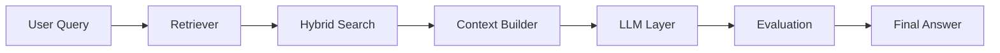

<h1 align="center">Hi, I'm Akshima Sharma 👋</h1>

  <b>Generative AI Engineer · LLMs · RAG · Agents · LLMOps</b> 
  Building production-grade AI systems that are reliable, fast, and actually useful.

  <a href="https://resilient-praline-1e5c44.netlify.app/" target="_blank">🌐 Portfolio</a> &nbsp;·&nbsp;
  <a href="https://www.linkedin.com/in/akshimasharma09/" target="_blank">💼 LinkedIn</a> &nbsp;·&nbsp;
  <a href="mailto:akshimasharma.connect@gmail.com">📧 Email</a>

---

### 👩‍💻 About Me

I'm a Generative AI Engineer with 3 years of experience building and deploying LLM-powered applications in production. I specialise in **RAG pipelines**, **agentic workflows**, and **LLM evaluation** — focused on reducing hallucinations, improving retrieval accuracy, and shipping AI that works reliably at scale.

Currently at **Trantor Pvt Ltd, Chandigarh**, working on enterprise GenAI products.

---

## 🚀 Featured Projects

---

### 🔍 Project Athena — Enterprise RAG QA System

> Production RAG system over enterprise documentation using LangChain, hybrid search (RRF), and LLM orchestration.

#### 📈 Impact

* Retrieval accuracy improved by **25%**
* Hallucination reduced **~15%**
* Latency and cost reduced **25–40%**
* Retrieval boosted **30%** via OCR + semantic chunking

#### 🧩 What I Built

* Hybrid search (RRF + semantic retrieval)
* Multi-provider LLM orchestration (OpenAI, Claude, Ollama)
* LLM-as-a-judge evaluation pipelines
* Ingestion pipeline with OCR + semantic chunking
* MS Teams integration with Adaptive Cards

#### 🧠 Architecture

#### 🎥 Demo

---

### 🤖 LLM-Based PR Risk Analyzer Agent

> Agentic system to analyze security and logic risks in pull requests using contextual + historical data.

#### 📈 Impact

* Saved **2–4 hours** per PR
* Reduced manual effort by **70–80%**

#### 🧩 What I Built

* Contextual + historical PR analysis
* Elasticsearch knowledge base
* Structured outputs (risk, confidence, impact)
* Automated documentation workflows

---

### 🧑‍💼 SourceSmart — AI Recruitment Platform

> LLM-powered candidate matching system built with Django, React, and PostgreSQL.

#### 📈 Impact

* **90% accuracy** in candidate matching
* **45% reduction** in recruiter effort
* **60% faster** screening

#### 🧩 What I Built

* Embedding-based candidate matching
* Scalable backend (Redis Queue + MinIO)
* Resume ingestion and ranking pipeline

---

### 📄 OCR & Anonymization System

#### 🧩 What I Built

* AWS Lambda-based OCR pipelines
* Microsoft Presidio + NLP anonymization
* Regex + NER-based masking
* Optimized ingestion pipelines

---

## 🧠 Case Study — Reducing Hallucination in RAG

**Problem**
LLM responses were inconsistent and hallucinating in production.

**Approach**

* Introduced hybrid retrieval (RRF + semantic search)
* Built LLM-as-a-judge evaluation pipelines
* Improved grounding via better context selection

**Outcome**

* Reduced hallucination by ~15%
* Improved answer reliability

---

## 🛠️ Tech Stack

| Area                | Tools                                                                              |
| ------------------- | ---------------------------------------------------------------------------------- |
| **Generative AI**   | RAG, LangChain, LangGraph, OpenAI API, Claude API, Prompt Engineering, Fine-tuning |
| **LLM Evaluation**  | LLM-as-a-judge, Hallucination benchmarking, Retrieval metrics                      |
| **Vector & Search** | FAISS, Pinecone, Elasticsearch                                                     |
| **Backend**         | FastAPI, Django, Flask, Python                                                     |
| **Databases**       | PostgreSQL, MongoDB, Redis                                                         |
| **MLOps & DevOps**  | Docker, Kubernetes, GitHub Actions, CI/CD                                          |
| **Cloud**           | AWS (S3, EC2, Lambda), GCP                                                         |
| **Data**            | ETL Pipelines, OCR, Web Scraping                                                   |

---

## 🎓 Education

* 🎓 **M.Sc. Systems Biology & Bioinformatics** — Panjab University (2021–2023)
* 🎓 **B.Sc. (Hons.) Bioinformatics** — Panjab University (2018–2021)

---

## 📬 Let's Connect

I'm open to **Generative AI**, **LLM Engineering**, and **ML Engineer** roles.

  

